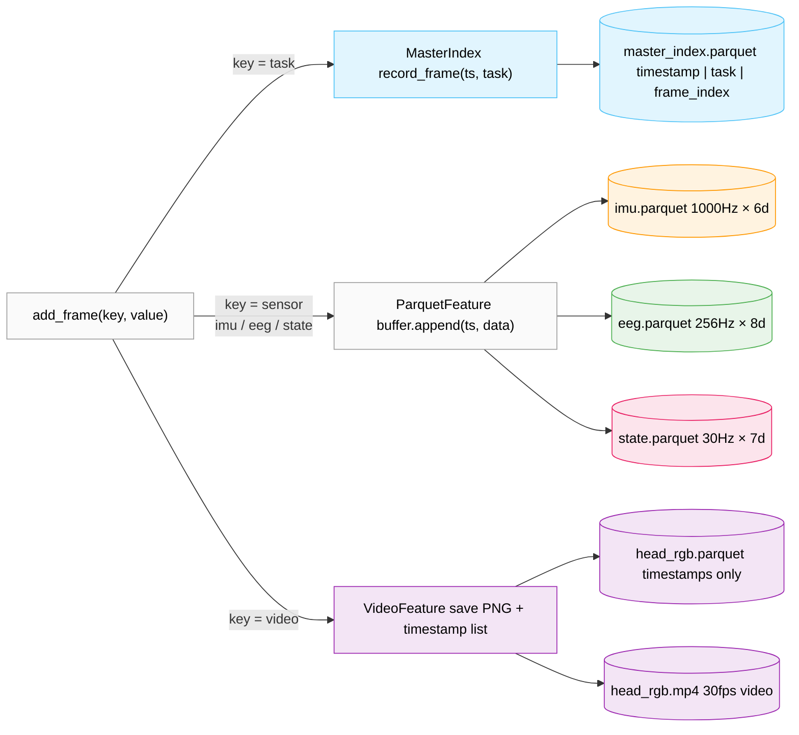
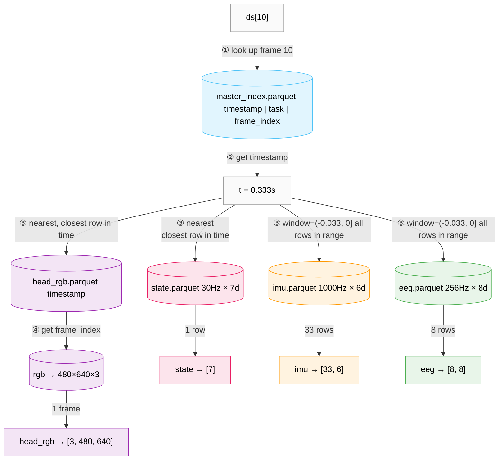
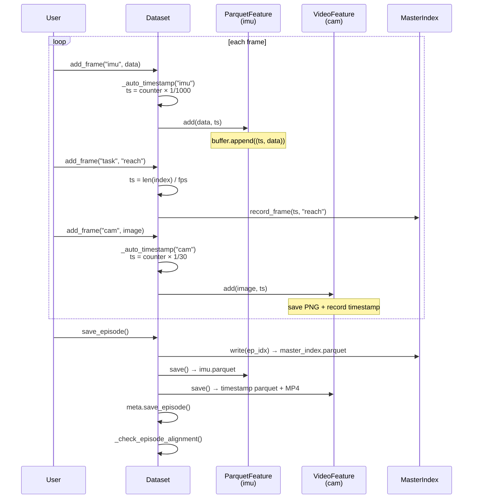
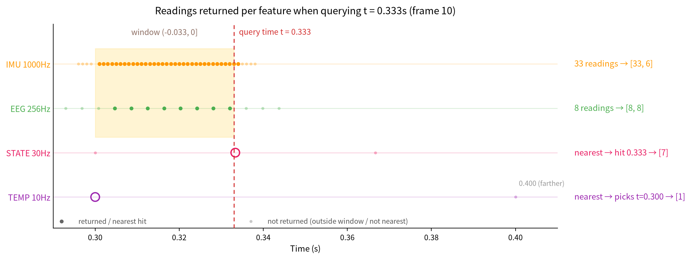
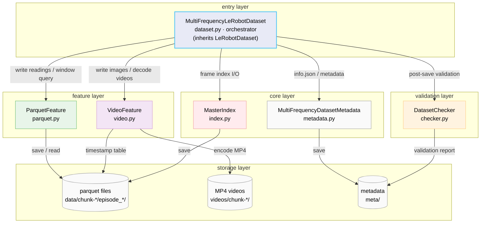

# Multi-Frequency LeRobot Dataset

> 📖 中文文档：[README_zh-CN.md](README_zh-CN.md)

**LeRobot multi-frequency sensor dataset extension** — heterogeneous sensors are stored at their independent sampling rates, one parquet file per sensor, dynamically aligned by time window at query time.

---

## Table of Contents

- [Multi-Frequency LeRobot Dataset](#multi-frequency-lerobot-dataset)
  - [Table of Contents](#table-of-contents)
  - [1. Motivation: Why Multi-Frequency Support](#1-motivation-why-multi-frequency-support)
  - [2. Installation](#2-installation)
  - [3. Quick Start](#3-quick-start)
  - [4. Core Concepts](#4-core-concepts)
    - [4.1 Per-Feature Independent Storage](#41-per-feature-independent-storage)
    - [4.2 Task as the Master Clock](#42-task-as-the-master-clock)
    - [4.3 Window Parameter](#43-window-parameter)
  - [5. API Reference](#5-api-reference)
    - [Creating a Dataset](#creating-a-dataset)
    - [Feature Definition Format](#feature-definition-format)
    - [Writing](#writing)
    - [Reading](#reading)
    - [Return Structure](#return-structure)
  - [6. Architecture](#6-architecture)
  - [7. Comparison with Native LeRobotDataset](#7-comparison-with-native-lerobotdataset)
  - [8. Demo & Visualization](#8-demo--visualization)
    - [Running the Demo](#running-the-demo)
    - [Visualizer Controls](#visualizer-controls)
  - [9. Acknowledgements](#9-acknowledgements)

---

## 1. Motivation: Why Multi-Frequency Support

Real robot systems typically include a variety of sensors with wildly different sampling rates:

| Sensor | Typical rate | Shape | Example |
|--------|---------|------|------|
| Camera RGB | 30 / 60 Hz | 480×640×3 | head camera + wrist camera |
| IMU | 50-1000 Hz | 6 (accel×3 + gyro×3) | accelerometer + gyroscope |
| EEG | 256 / 512 / 1000 Hz | 8-256 channels | brain signals |
| EMG | 20-500 Hz | 4-16 channels | muscle signals |

The native LeRobotDataset squeezes everything into one merged parquet: low-rate sensors have to be upsampled, high-rate sensors get truncated or averaged — the original time precision is lost.

**The mf_lerobot solution**: every sensor is stored independently as a time-indexed parquet file. At read time, a `window` parameter defines "how to aggregate data around the query timestamp" — no pre-resampling needed.

**Writing** — `add_frame` routes each key to its feature buffer; `save_episode()` flushes them to disk:



**Reading** — look up the master-clock timestamp in `master_index`, then query each feature by that timestamp:



The result of `ds[10]` (t=0.333s):
- `state` → nearest match → `[7]`
- `imu` → all 33 readings in the `(-0.033, 0]` window → `[33, 6]`
- `eeg` → all 8 readings in the `(-0.033, 0]` window → `[8, 8]`
- `head_rgb` → nearest row in timestamp parquet → `frame_index` → decode that frame → `[3, 480, 640]`

## 2. Installation

```bash
git clone https://github.com/Koorye/Multi-Frequency-LeRobot
cd Multi-Frequency-LeRobot
pip install -e .

# dependencies
pip install -r requirements.txt
```

Dependencies:

| Dependency | Purpose |
|------|------|
| `lerobot` | base dataset framework (inherits LeRobotDataset) |
| `pyarrow` | parquet file I/O |
| `numpy` / `torch` | data processing |
| `pyav` | video encoding/decoding |
| `matplotlib` | visualization (optional) |
| `h5py` | HDF5 data reading (optional) |

## 3. Quick Start

```python
import numpy as np
from mf_lerobot import MultiFrequencyLeRobotDataset

ds = MultiFrequencyLeRobotDataset.create(
    repo_id="my_robot", root="data/", fps=30,
    features={
        # camera: dtype="video" auto-encodes to MP4
        "observation.images.cam": {
            "dtype": "video", "shape": (480, 640, 3),
            "names": ["h", "w", "c"], "fps": 30,
        },
        # high-rate IMU: window defines "return all readings in (t-33ms, t]"
        "observation.imu": {
            "dtype": "float32", "shape": (6,),
            "names": ["ax", "ay", "az", "gx", "gy", "gz"],
            "fps": 1000,
            "window": (-0.033, 0.0),
            "tolerance_s": 0.002,
        },
        # mid-rate EEG
        "observation.eeg": {
            "dtype": "float32", "shape": (8,),
            "names": ["Fz", "Cz", "Pz", "Oz", "F3", "F4", "C3", "C4"],
            "fps": 256,
            "window": (-0.033, 0.0),
        },
        # end-effector pose: no window → nearest neighbor by default
        "observation.state": {
            "dtype": "float32", "shape": (7,),
            "names": ["x", "y", "z", "roll", "pitch", "yaw", "gripper"],
            "fps": 30,
        },
        "action": {
            "dtype": "float32", "shape": (7,),
            "names": ["dx", "dy", "dz", "droll", "dpitch", "dyaw", "dgrip"],
            "fps": 30,
        },
    },
)

# recording: task = master clock, each frame is bounded by a task call
for i in range(300):
    # high-rate sensors: multiple writes per frame
    for _ in range(33):   # 1000Hz / 30fps ≈ 33
        ds.add_frame("observation.imu", imu_sample)
    for _ in range(8):    # 256Hz / 30fps ≈ 8
        ds.add_frame("observation.eeg", eeg_sample)

    # a task call = frame boundary, timestamp auto-generated
    ds.add_frame("task", "reach_target")

    # camera-rate sensors: once per frame
    ds.add_frame("observation.state", joint_state)
    ds.add_frame("action", action_cmd)
    ds.add_frame("observation.images.cam", camera_image)

ds.save_episode()
```

**Reading** — window features return all readings in the window, nearest features return a single vector:

```python
ds = MultiFrequencyLeRobotDataset(repo_id="my_robot", root="data/")
item = ds[10]

item["observation.imu"]             # tensor([33, 6]) — 33 readings in (-0.033, 0]
item["observation.imu_timestamps"]  # tensor([33])
item["observation.eeg"]             # tensor([8, 8])
item["observation.state"]           # tensor([7]) — nearest
item["observation.images.cam"]      # tensor([3, 480, 640]) — CHW
item["task"]                        # "reach_target"
```



## 4. Core Concepts

### 4.1 Per-Feature Independent Storage

Storage layout:

```
data/
└── chunk-000/
    └── episode_000000/
        ├── master_index.parquet                # timestamp | frame_index | task_index
        ├── observation.imu.parquet             # 1000Hz · 1980 rows · 6 cols
        ├── observation.eeg.parquet             # 256Hz · 512 rows · 8 cols
        ├── observation.state.parquet           # 30Hz · 60 rows · 7 cols
        └── observation.images.head_rgb.parquet # 30Hz · 60 rows · timestamps only

videos/
└── chunk-000/
    └── observation.images.head_rgb/
        └── episode_000000.mp4
```

Every non-video feature gets one parquet with a uniform column layout:

```
timestamp (float64) | episode_index (int64) | col_0 (float32) | ... | col_D (float32)
```

- camera-rate features (state, action): one row per frame, rows = frames
- high-rate features (imu, eeg): multiple samples between frames, rows = rate × duration
- camera features: timestamp parquet + MP4 video

### 4.2 Task as the Master Clock

The whole dataset is organized around **task calls as frame boundaries**: `add_frame("task", ...)` declares "the current frame ends here, the next one begins".

- **Frame** = all feature data written between two task calls. `add_frame("task", ...)` auto-generates the frame timestamp: `t = frame_index / fps` (override with `timestamp=` if needed)
- **Master clock** = the frame sequence. Reading `ds[i]` first looks up the i-th frame timestamp t in `master_index`; every feature is then aligned around t (window / nearest neighbor, see 4.3)
- **Each feature's timestamps are generated independently** of the master clock: one counter per feature, `ts = timestamp_start + counter × (1 / fps)` on each `add_frame`; counters reset after `save_episode()`
- **No master_feature to configure** — task is the master clock, and features of any sampling rate align to it

```python
# standard call order per frame: high-rate first → task bounds the frame → low-rate last
ds.add_frame("observation.imu", ...)   # high-rate sensor, written multiple times between frames
ds.add_frame("observation.eeg", ...)
ds.add_frame("task", "pick_up")        # ← frame boundary: frame_index++, master-clock timestamp
ds.add_frame("observation.state", ...) # camera-rate sensor, once per frame
ds.add_frame("observation.images.cam", image)
```

### 4.3 Window Parameter

The master-clock frame timestamp is the query anchor, but a feature's readings don't necessarily land on a frame — `window` defines "how to aggregate that feature's readings around the frame timestamp":

| `window` value | Behavior | Typical use |
|------------|------|---------|
| `None` (default) | nearest neighbor: return the single closest reading | camera-rate sensors (state, action) |
| `"interpolate"` | linear interpolation at the query time | mid-rate sensors (finger pose) |
| `(start_s, end_s)` | range query: return all readings in `(t+start, t+end]` | high-rate sensors (IMU, EEG, EMG) |

```python
# IMU at 1000Hz, 30fps master → ~33 readings per frame
"window": (-0.033, 0.0)   # (t-33ms, t]

# wider window for context
"window": (-0.066, 0.0)   # (t-66ms, t], ~66 readings

# override at read time
ds = MultiFrequencyLeRobotDataset(
    repo_id="my_robot", root="data/",
    window_overrides={"observation.imu": (-0.100, 0.0)},
)
```

**Readings returned per feature when querying t = 0.333s (frame 10):**



Note that temperature (10Hz) has no sample at 0.333 — its sampling grid is 0.3, 0.4, …, so nearest neighbor falls back to the reading at t=0.300.

## 5. API Reference

### Creating a Dataset

```python
ds = MultiFrequencyLeRobotDataset.create(
    repo_id="my_robot",
    fps=30,
    features={...},          # see Feature Definition Format below
)
```

| Parameter | Type | Default | Description |
|------|------|--------|------|
| `repo_id` | `str` | — | dataset name, directory name under `root` |
| `fps` | `float` | — | master-clock frame rate; frame timestamp = `frame_index / fps` |
| `features` | `dict[str, dict]` | — | feature definitions, format below |
| `root` | `str \| Path` | `~/.cache/huggingface/lerobot/<repo_id>` | storage root directory |
| `robot_type` | `str` | `None` | robot type, metadata only |
| `use_videos` | `bool` | `True` | whether `dtype="video"` features are encoded to MP4 |
| `image_writer_processes` | `int` | `0` | image writer subprocess count (0 = write in main process) |
| `image_writer_threads` | `int` | `0` | image writer thread count |
| `video_backend` | `str` | `None` | video backend (e.g. `"pyav"`), `None` auto-selects |
| `batch_encoding_size` | `int` | `1` | batch-encode videos every N episodes |
| `window_overrides` | `dict` | `None` | override each feature's window (same format as at read time) |

### Feature Definition Format

```python
features = {
    "feature_key": {
        "dtype": "video" | "float32" | "int64",   # required
        "shape": (H, W, C) | (D,),                # required
        "names": ["col_0", ...],                  # required
        # optional:
        "fps": 1000,              # sampling rate of this feature
        "window": (-0.033, 0.0),  # query window
        "timestamp_start": 0.1,   # timestamp start offset
        "tolerance_s": 0.002,     # alignment tolerance
    }
}
```

| Field | Type | Required | Description |
|------|------|------|------|
| `dtype` | `str` | ✓ | storage type: `"float32"` (continuous), `"int64"` (discrete/id), `"video"` (camera frames) |
| `shape` | `tuple` | ✓ | shape of a single reading: `(D,)` for numeric features, `(H, W, C)` for video |
| `names` | `list[str]` | ✓ | column name per dimension (used as parquet column names) |
| `fps` | `float` | optional | sampling rate of this feature; timestamps are auto-generated as `timestamp_start + counter × 1/fps`; falls back to master-clock `fps` if omitted |
| `window` | `None \| "interpolate" \| (start, end)` | `None` | how readings are aggregated at query time (see 4.3) |
| `timestamp_start` | `float` | `0.0` | timestamp start offset, e.g. the sensor only starts recording at t=0.1s |
| `tolerance_s` | `float` | `None` | alignment tolerance: after `save_episode()`, per-frame nearest-reading gaps are checked and violations are logged to `meta/alignment_check.jsonl` |

Conventions and tips:

- feature keys follow LeRobot naming and **must not contain `/`** (e.g. `observation.imu`, `action`)
- `dtype="video"` features only store a timestamp parquet; images are encoded as MP4 under `videos/`
- always give high-rate features both `fps` and `window` — otherwise the nearest-neighbor query returns a single reading and the high-rate information is lost

### Writing

```python
ds.add_frame(key: str, value: np.ndarray | torch.Tensor | str,
             timestamp: float | None = None)
ds.save_episode()
```

- `key`: `"task"` or a defined feature key
- `value`: `np.ndarray` / `torch.Tensor` for numeric features (shape must match `shape`); `np.ndarray` (H, W, C) for video features; `str` task label for task
- `timestamp`: `None` auto-generates — task uses the master clock `len(records) / fps`, other features use their own counter `timestamp_start + counter × 1/fps`; pass a `float` to set it manually

A complete write loop:

```python
FPS = 30
imu_per_frame = 1000 // FPS   # 33
eeg_per_frame = 256 // FPS    # 8

for frame in range(60):                        # 2 seconds / 30fps
    for _ in range(imu_per_frame):             # high-rate: multiple writes per frame
        ds.add_frame("observation.imu", imu_sample)
    for _ in range(eeg_per_frame):
        ds.add_frame("observation.eeg", eeg_sample)

    ds.add_frame("task", "reach_target")       # ← frame boundary

    ds.add_frame("observation.state", joint_state)    # low-rate: once per frame
    ds.add_frame("action", action_cmd)
    ds.add_frame("observation.images.cam", camera_image)

ds.save_episode()    # flush all buffers, run alignment/video checks, reset counters
```

### Reading

```python
ds = MultiFrequencyLeRobotDataset(
    repo_id="robot", root="data/",
    episodes=[0, 2],                                    # load only episodes 0, 2
    image_transforms=my_transforms,                      # torchvision transforms
    delta_timestamps={"observation.state": [-0.1, 0, 0.1]},  # multi-frame query
    window_overrides={"observation.imu": (-0.066, 0)},   # override window
    video_backend="pyav",
)
item = ds[10]
```

| Parameter | Type | Default | Description |
|------|------|--------|------|
| `repo_id` | `str` | — | dataset name |
| `root` | `str \| Path` | `~/.cache/huggingface/lerobot/<repo_id>` | storage root directory |
| `episodes` | `list[int]` | `None` | load only the given episode indices |
| `image_transforms` | callable | `None` | image transforms (torchvision style) |
| `delta_timestamps` | `dict[str, list[float]]` | `None` | multi-frame query: returns `{key: master frame + each offset frame}`, e.g. `{"observation.state": [-0.1, 0, 0.1]}` |
| `tolerance_s` | `float` | `1e-4` | frame-alignment tolerance for `delta_timestamps` |
| `video_backend` | `str` | `None` | video decoding backend (e.g. `"pyav"`) |
| `batch_encoding_size` | `int` | `1` | (write side) video batch-encoding size |
| `window_overrides` | `dict` | `None` | override each feature's window at read time, e.g. `{"observation.imu": (-0.066, 0)}` |

### Return Structure

```python
item = ds[10]
# {
#     "timestamp": tensor(0.3333),
#     "frame_index": tensor(10),
#     "episode_index": tensor(0),
#     "index": tensor(10),
#     "task_index": tensor(0),
#     "task": "reach_target",
#
#     # window feature: all readings + timestamps
#     "observation.imu": tensor([33, 6]),
#     "observation.imu_timestamps": tensor([33]),
#
#     # nearest feature: a single vector
#     "observation.state": tensor([7]),
#     "observation.temperature": tensor([1]),
#
#     # video feature: CHW format
#     "observation.images.head_rgb": tensor([3, 480, 640]),
# }
```

## 6. Architecture



**File layout:**

```
src/mf_lerobot/
├── dataset.py      (309 lines)  orchestrator — add_frame / save_episode / __getitem__
├── parquet.py      (168 lines)  ParquetFeature — write buffer, save parquet, load, window query
├── video.py        (137 lines)  VideoFeature — save PNG, encode MP4, decode frames
├── index.py        (129 lines)  MasterIndex — frame index I/O
├── metadata.py     (123 lines)  MultiFrequencyDatasetMetadata — info.json management
├── checker.py      (116 lines)  DatasetChecker — video frame count + timestamp alignment checks
└── utils.py        (214 lines)  constants + info.json creation/validation
```

**Design principles:**

1. **One object per feature**: `ParquetFeature` and `VideoFeature` each encapsulate their buffer, file paths, and read/write logic. The Dataset is only an orchestrator.

2. **Symmetric read/write**: every Feature provides both `add/save` (write) and `load/query` (read).

3. **Deterministic paths**: file paths depend only on `episode_index` and `feature_key`; no lookups in `episodes.jsonl`.

4. **Inherit, don't rewrite**: inherit `LeRobotDataset` for `start_image_writer`, `_save_image` and other basics; only 4 core methods are overridden.

## 7. Comparison with Native LeRobotDataset

| Aspect | Native LeRobotDataset | mf_lerobot |
|------|-------------------|------------|
| Storage | 1 merged parquet | N per-feature parquets |
| Multi-rate sensors | pre-resampling required | native rates, independent storage |
| Time alignment | `tolerance_s` tolerance matching | window mechanism (range / interpolate / nearest) |
| Master clock | camera frame | `add_frame("task", ...)` calls |
| Video encoding | unified batch encoding in `save_episode` | independent per VideoFeature |
| Metadata | `episodes.jsonl` records everything | only basic frame info; paths computed deterministically |
| per-feature fps | not supported | independent `fps` per feature |
| per-feature tolerance | global `tolerance_s` | independent `tolerance_s` per feature |
| Write API | `add_frame(frame_dict, task)` | `add_frame(key, value)` per field |
| Alignment check | none | automatic `alignment_check.jsonl` |
| Video check | none | automatic frame count/duration check |

## 8. Demo & Visualization

### Running the Demo

```bash
# write 3 episodes of simulated data
python -m examples.01write_simple

# read and inspect the data
python -m examples.01read_simple

# interactive visualizer
python -m scripts.visualize --episode 0
```

Numbered examples (`examples/`):

| Script | What it does |
|--------|--------------|
| `01write_simple.py` | main write demo: 3 cameras + IMU + EEG + EMG + temperature, 3 two-second episodes |
| `01read_simple.py` | main read demo: window / nearest / read-time override / camera decoding (needs data from 01write_simple) |
| `02tolerance_example.py` | alignment check: late sensor start + tight tolerance → prints `meta/alignment_check.jsonl` |
| `03window_example.py` | compares the three window modes: range / interpolate / nearest, plus read-time override |
| `04delta_example.py` | `delta_timestamps` multi-frame query: state at t-0.1 / t / t+0.1 |

Sensors included in the demo:

| Sensor | Shape | Rate | Window |
|--------|------|------|--------|
| head_rgb | 480×640×3 | 30 fps | — (video) |
| left_wrist_rgb | 480×640×3 | 30 fps | — (video) |
| right_wrist_rgb | 480×640×3 | 30 fps | — (video) |
| imu | 6 (accel+gyro) | 1000 Hz | (-0.033, 0.0) |
| eeg | 8 (EEG channels) | 256 Hz | (-0.033, 0.0) |
| emg_left | 4 (muscle channels) | 100 Hz | (-0.033, 0.0) |
| emg_right | 4 (muscle channels) | 100 Hz | (-0.033, 0.0) |
| temperature | 1 | 10 Hz | — (nearest) |
| state | 7 (x,y,z,r,p,y,grip) | 30 Hz | — (nearest) |
| action | 7 (velocity commands) | 30 Hz | — (nearest) |

Three 2-second episodes: `reach_target`, `pour_liquid`, `stack_blocks`.

**Visualizer** (`python -m scripts.visualize --episode 0`):


### Visualizer Controls

```
space    — play / pause
← →      — step frame backward / forward
↑ ↓      — faster / slower playback
w s      — widen / shrink the window
q / Esc  — quit
```


## 9. Acknowledgements

This project builds on the following open-source projects and work:

- **[LeRobot](https://github.com/huggingface/lerobot)** — the base dataset framework. This project inherits the API design of `LeRobotDataset` and `LeRobotDatasetMetadata` and reuses its video encoding and image writing infrastructure. Thanks to the Hugging Face team for their contributions to the open-source robot learning ecosystem.

- **[PyArrow](https://arrow.apache.org/docs/python/)** — high-performance columnar storage, the basis of per-feature parquet I/O.

- **[PyAV](https://pyav.org/)** — Python bindings for FFmpeg, powering video encoding (AV1) and decoding.

- **[Matplotlib](https://matplotlib.org/)** — visualization.

- The [Neuropixels](https://www.neuropixels.org/) data format and the BIDS standard from the **[Allen Institute for Neural Dynamics](https://alleninstitute.org/division/neural-dynamics/)** — inspiration for organizing multimodal neural data.

Thanks to all colleagues for feedback and discussions.
