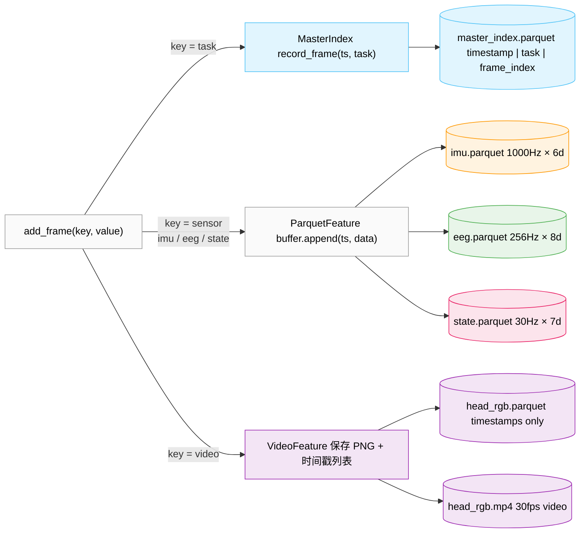
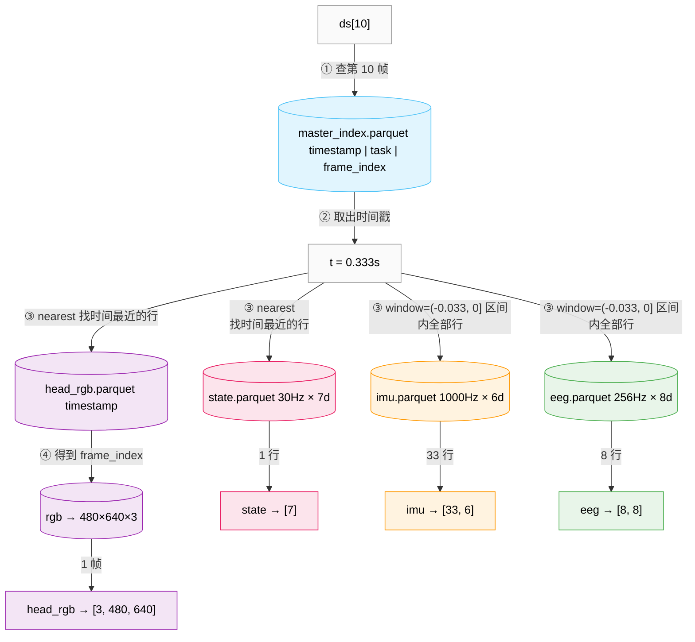
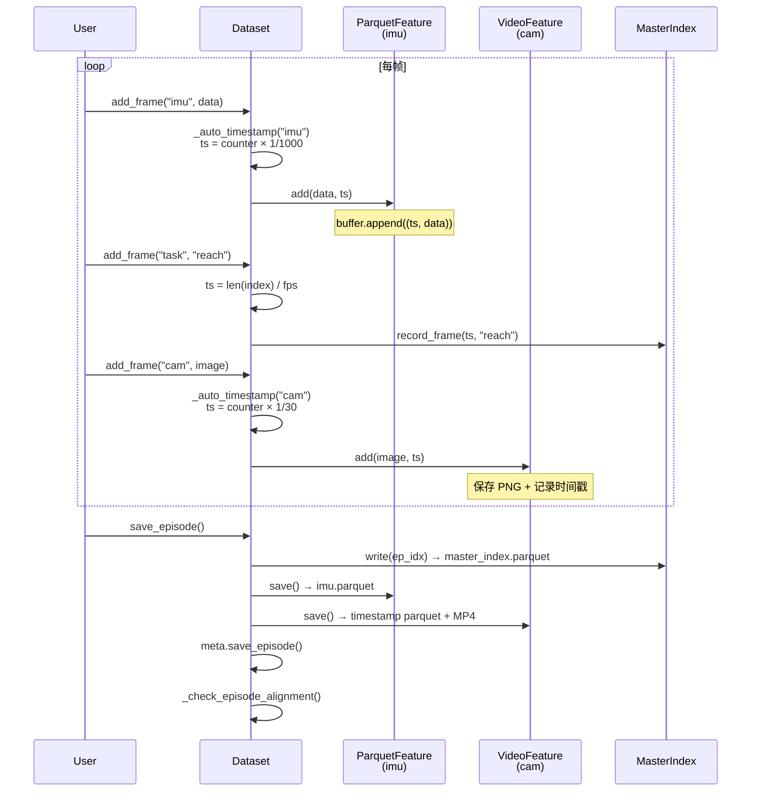
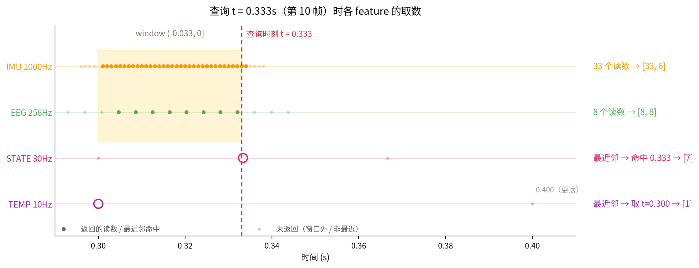
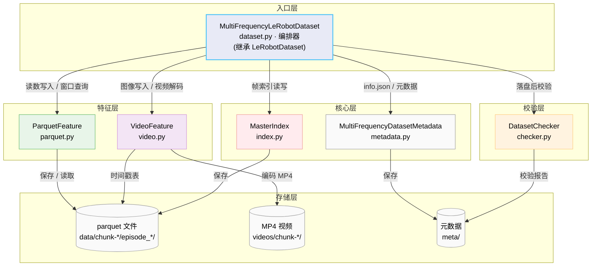
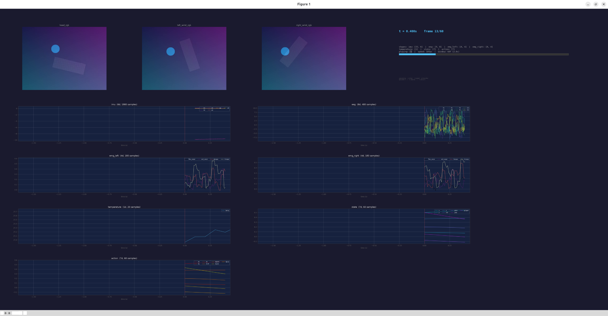

# Multi-Frequency LeRobot Dataset

> 📖 English docs: [README.md](README.md)

**LeRobot 多频率传感器数据集扩展** — 异构传感器以独立采样率存储，每个传感器一个 parquet 文件，查询时按时间窗口动态对齐。

---

## 目录

- [Multi-Frequency LeRobot Dataset](#multi-frequency-lerobot-dataset)
  - [目录](#目录)
  - [1. 动机：为什么需要多频率支持](#1-动机为什么需要多频率支持)
  - [2. 安装](#2-安装)
  - [3. 快速开始](#3-快速开始)
  - [4. 核心概念](#4-核心概念)
    - [4.1 每特征独立存储](#41-每特征独立存储)
    - [4.2 Task 即主时钟](#42-task-即主时钟)
    - [4.3 Window 参数](#43-window-参数)
  - [5. API 参考](#5-api-参考)
    - [创建数据集](#创建数据集)
    - [Feature 定义格式](#feature-定义格式)
    - [写入](#写入)
    - [读取](#读取)
    - [读取返回结构](#读取返回结构)
  - [6. 架构设计](#6-架构设计)
  - [7. 与原生 LeRobotDataset 对比](#7-与原生-lerobotdataset-对比)
  - [8. Demo 与可视化](#8-demo-与可视化)
    - [运行 Demo](#运行-demo)
    - [可视化操作](#可视化操作)
  - [9. 致谢](#9-致谢)

---

## 1. 动机：为什么需要多频率支持

真实机器人系统通常包含多种传感器，采样率差异巨大：

| 传感器 | 典型频率 | 维度 | 示例 |
|--------|---------|------|------|
| 相机 RGB | 30 / 60 Hz | 480×640×3 | 头部相机 + 腕部相机 |
| IMU | 50-1000 Hz | 6 (accel×3 + gyro×3) | 加速度计 + 陀螺仪 |
| EEG | 256 / 512 / 1000 Hz | 8-256 通道 | 脑电信号 |
| EMG | 20-500 Hz | 4-16 通道 | 肌电信号 |

原生 LeRobotDataset 把所有数据压入一个合并 parquet，低频率传感器需要上采样、高频率传感器被截断或平均——丢失了原始时间精度。

**mf_lerobot 的解决方案**：每个传感器独立存储为时间索引的 parquet 文件。读取时通过 `window` 参数定义"如何围绕查询时间戳聚合数据"——无需预先重采样。

**写入** — `add_frame` 按 key 分流到对应 feature 缓冲，`save_episode()` 时各自落盘：



**读取** — 先查 `master_index` 得到主时钟时间戳，再按时间戳查询各 feature：



查询 `ds[10]`（t=0.333s）的结果：
- `state` → 最近邻匹配 → `[7]`
- `imu` → `(-0.033, 0]` 窗口内 33 个读数 → `[33, 6]`
- `eeg` → `(-0.033, 0]` 窗口内 8 个读数 → `[8, 8]`
- `head_rgb` → timestamp parquet 最近邻 → `frame_index` → 解码对应帧 → `[3, 480, 640]`

## 2. 安装

```bash
git clone <repo-url>
cd <repo>
pip install -e .

# 依赖
pip install -r requirements.txt
```

依赖说明：

| 依赖 | 用途 |
|------|------|
| `lerobot` | 基础数据集框架（继承 LeRobotDataset） |
| `pyarrow` | parquet 文件读写 |
| `numpy` / `torch` | 数据处理 |
| `pyav` | 视频编码/解码 |
| `matplotlib` | 可视化（可选） |
| `h5py` | HDF5 数据读取（可选） |

## 3. 快速开始

```python
import numpy as np
from mf_lerobot import MultiFrequencyLeRobotDataset

ds = MultiFrequencyLeRobotDataset.create(
    repo_id="my_robot", root="data/", fps=30,
    features={
        # 相机：dtype="video" 自动编码为 MP4
        "observation.images.cam": {
            "dtype": "video", "shape": (480, 640, 3),
            "names": ["h", "w", "c"], "fps": 30,
        },
        # 高频 IMU：window 定义"返回 (t-33ms, t] 的所有读数"
        "observation.imu": {
            "dtype": "float32", "shape": (6,),
            "names": ["ax", "ay", "az", "gx", "gy", "gz"],
            "fps": 1000,
            "window": (-0.033, 0.0),
            "tolerance_s": 0.002,
        },
        # 中频 EEG
        "observation.eeg": {
            "dtype": "float32", "shape": (8,),
            "names": ["Fz", "Cz", "Pz", "Oz", "F3", "F4", "C3", "C4"],
            "fps": 256,
            "window": (-0.033, 0.0),
        },
        # 末端位姿：无 window，默认最近邻
        "observation.state": {
            "dtype": "float32", "shape": (7,),
            "names": ["x", "y", "z", "roll", "pitch", "yaw", "gripper"],
            "fps": 30,
        },
        "action": {
            "dtype": "float32", "shape": (7,),
            "names": ["dx", "dy", "dz", "droll", "dpitch", "dyaw", "dgrip"],
            "fps": 30,
        },
    },
)

# 记录：task = 主时钟，每帧以 task 调用为界
for i in range(300):
    # 高频传感器：每帧读写多次
    for _ in range(33):   # 1000Hz / 30fps ≈ 33
        ds.add_frame("observation.imu", imu_sample)
    for _ in range(8):    # 256Hz / 30fps ≈ 8
        ds.add_frame("observation.eeg", eeg_sample)

    # task 调用 = 帧边界，自动生成时间戳
    ds.add_frame("task", "reach_target")

    # 相机帧率传感器：每帧读写一次
    ds.add_frame("observation.state", joint_state)
    ds.add_frame("action", action_cmd)
    ds.add_frame("observation.images.cam", camera_image)

ds.save_episode()
```

**读取** — window feature 返回窗口内全部读数，nearest feature 返回最近邻单值：

```python
ds = MultiFrequencyLeRobotDataset(repo_id="my_robot", root="data/")
item = ds[10]

item["observation.imu"]             # tensor([33, 6]) — (-0.033, 0] 内 33 个读数
item["observation.imu_timestamps"]  # tensor([33])
item["observation.eeg"]             # tensor([8, 8])
item["observation.state"]           # tensor([7]) — 最近邻
item["observation.images.cam"]      # tensor([3, 480, 640]) — CHW
item["task"]                        # "reach_target"
```



## 4. 核心概念

### 4.1 每特征独立存储

存储布局：

```
data/
└── chunk-000/
    └── episode_000000/
        ├── master_index.parquet                # timestamp | frame_index | task_index
        ├── observation.imu.parquet             # 1000Hz · 1980 行 · 6 列
        ├── observation.eeg.parquet             # 256Hz · 512 行 · 8 列
        ├── observation.state.parquet           # 30Hz · 60 行 · 7 列
        └── observation.images.head_rgb.parquet # 30Hz · 60 行 · 仅时间戳

videos/
└── chunk-000/
    └── observation.images.head_rgb/
        └── episode_000000.mp4
```

每个非视频 feature 一个 parquet，列格式统一：

```
timestamp (float64) | episode_index (int64) | col_0 (float32) | ... | col_D (float32)
```

- 相机帧率特征（state, action）：每帧一行，行数 = 帧数
- 高频特征（imu, eeg）：帧间多次采样，行数 = 频率 × 时长
- 相机特征：timestamp parquet + MP4 视频

### 4.2 Task 即主时钟

整个数据集以 **task 调用为帧边界**组织：`add_frame("task", ...)` 声明"当前帧到此结束，下一帧开始"。

- **帧** = 两次 task 调用之间写入的所有 feature 数据。`add_frame("task", ...)` 时自动生成帧时间戳：`t = frame_index / fps`（也可用 `timestamp=` 手动传入覆盖）
- **主时钟** = 帧序列。读取 `ds[i]` 时先查 `master_index` 得到第 i 帧的时间戳 t，所有 feature 再围绕 t 对齐（window / 最近邻，见 4.3）
- **各 feature 的时间戳独立生成**，与主时钟无关：每个 feature 一个计数器，`add_frame` 时 `ts = timestamp_start + counter × (1 / fps)`；计数器在 `save_episode()` 后归零

```python
# 每帧的标准调用顺序：高频先写 → task 定边界 → 低频收尾
ds.add_frame("observation.imu", ...)   # 高频传感器，帧间多次写入
ds.add_frame("observation.eeg", ...)
ds.add_frame("task", "pick_up")        # ← 帧边界：frame_index++，落主时钟时间戳
ds.add_frame("observation.state", ...) # 相机帧率传感器，每帧一次
ds.add_frame("observation.images.cam", image)
```

### 4.3 Window 参数

主时钟的帧时间戳是查询基准，但 feature 的读数时刻并不一定落在帧上——`window` 定义"如何围绕帧时间戳聚合该 feature 的读数"：

| `window` 值 | 行为 | 适用场景 |
|------------|------|---------|
| `None`（默认） | 最近邻：返回时间最接近的单个读数 | 相机帧率传感器 (state, action) |
| `"interpolate"` | 线性插值：在查询时间点插值 | 中等频率传感器 (finger pose) |
| `(start_s, end_s)` | 区间查询：返回 `(t+start, t+end]` 所有读数 | 高频传感器 (IMU, EEG, EMG) |

```python
# IMU at 1000Hz, 30fps master → ~33 readings per frame
"window": (-0.033, 0.0)   # (t-33ms, t]

# Wider window for context
"window": (-0.066, 0.0)   # (t-66ms, t], ~66 readings

# 读取时动态覆盖
ds = MultiFrequencyLeRobotDataset(
    repo_id="my_robot", root="data/",
    window_overrides={"observation.imu": (-0.100, 0.0)},
)
```

**查询 t = 0.333s（第 10 帧）时各 feature 的取数：**



注意 temperature（10Hz）在 0.333 处没有采样点——采样网格是 0.3、0.4、…，最近邻自动回退到 t=0.300 的读数。

## 5. API 参考

### 创建数据集

```python
ds = MultiFrequencyLeRobotDataset.create(
    repo_id="my_robot",
    fps=30,
    features={...},          # 见下文 Feature 定义格式
)
```

| 参数 | 类型 | 默认值 | 说明 |
|------|------|--------|------|
| `repo_id` | `str` | — | 数据集名称，`root` 下的存储目录名 |
| `fps` | `float` | — | 主时钟帧率，帧时间戳 = `frame_index / fps` |
| `features` | `dict[str, dict]` | — | 特征定义，格式见下文 |
| `root` | `str \| Path` | `~/.cache/huggingface/lerobot/<repo_id>` | 存储根目录 |
| `robot_type` | `str` | `None` | 机器人类型，仅写入元数据 |
| `use_videos` | `bool` | `True` | `dtype="video"` 的特征是否编码为 MP4 |
| `image_writer_processes` | `int` | `0` | 图像写入子进程数（0 = 主进程内写入） |
| `image_writer_threads` | `int` | `0` | 图像写入线程数 |
| `video_backend` | `str` | `None` | 视频后端（如 `"pyav"`），`None` 自动选择 |
| `batch_encoding_size` | `int` | `1` | 每 N 个 episode 批量编码一次视频 |
| `window_overrides` | `dict` | `None` | 覆盖各 feature 的 window（格式同读取时） |

### Feature 定义格式

```python
features = {
    "feature_key": {
        "dtype": "video" | "float32" | "int64",   # 必填
        "shape": (H, W, C) | (D,),                # 必填
        "names": ["col_0", ...],                  # 必填
        # 可选：
        "fps": 1000,              # 此 feature 的采样率
        "window": (-0.033, 0.0),  # 查询窗口
        "timestamp_start": 0.1,   # 时间戳起始偏移
        "tolerance_s": 0.002,     # 对齐容差
    }
}
```

| 字段 | 类型 | 必填 | 说明 |
|------|------|------|------|
| `dtype` | `str` | ✓ | 存储类型：`"float32"`（连续量）、`"int64"`（离散量/id）、`"video"`（相机帧） |
| `shape` | `tuple` | ✓ | 单个读数的形状：数值 feature 为 `(D,)`，视频为 `(H, W, C)` |
| `names` | `list[str]` | ✓ | 每个维度的列名（作为 parquet 列名） |
| `fps` | `float` | 可选 | 该 feature 的采样率，自动生成时间戳 `timestamp_start + counter × 1/fps`；不填回退到主时钟 `fps` |
| `window` | `None \| "interpolate" \| (start, end)` | `None` | 查询时如何聚合读数（见 4.3） |
| `timestamp_start` | `float` | `0.0` | 时间戳起始偏移，如传感器在 t=0.1s 才开始记录 |
| `tolerance_s` | `float` | `None` | 对齐容差：`save_episode()` 后检查每帧最近读数的偏差，超差记录到 `meta/alignment_check.jsonl` |

约定与提示：

- feature key 遵循 LeRobot 命名约定，**不可包含 `/`**（如 `observation.imu`、`action`）
- `dtype="video"` 的特征只存时间戳 parquet，图像编码为 MP4 存在 `videos/` 下
- 高频 feature 务必同时给 `fps` + `window`——否则查询按最近邻只返回 1 个读数，高频信息会丢失

### 写入

```python
ds.add_frame(key: str, value: np.ndarray | torch.Tensor | str,
             timestamp: float | None = None)
ds.save_episode()
```

- `key`：`"task"` 或已定义的 feature key
- `value`：数值 feature 为 `np.ndarray` / `torch.Tensor`（形状须匹配 `shape`）；视频 feature 为 `np.ndarray` (H, W, C)；task 为 `str` 任务标签
- `timestamp`：`None` 时自动生成——task 用主时钟 `len(records) / fps`，其他 feature 用自身计数器 `timestamp_start + counter × 1/fps`；传 `float` 则手动指定

完整写循环：

```python
FPS = 30
imu_per_frame = 1000 // FPS   # 33
eeg_per_frame = 256 // FPS    # 8

for frame in range(60):                        # 2 秒 / 30fps
    for _ in range(imu_per_frame):             # 高频：每帧多次写入
        ds.add_frame("observation.imu", imu_sample)
    for _ in range(eeg_per_frame):
        ds.add_frame("observation.eeg", eeg_sample)

    ds.add_frame("task", "reach_target")       # ← 帧边界

    ds.add_frame("observation.state", joint_state)    # 低频：每帧一次
    ds.add_frame("action", action_cmd)
    ds.add_frame("observation.images.cam", camera_image)

ds.save_episode()    # 落盘全部 buffer，校验对齐/视频帧数，重置计数器
```

### 读取

```python
ds = MultiFrequencyLeRobotDataset(
    repo_id="robot", root="data/",
    episodes=[0, 2],                                    # 只加载 episode 0, 2
    image_transforms=my_transforms,                      # torchvision transforms
    delta_timestamps={"observation.state": [-0.1, 0, 0.1]},  # 多帧查询
    window_overrides={"observation.imu": (-0.066, 0)},   # 覆盖 window
    video_backend="pyav",
)
item = ds[10]
```

| 参数 | 类型 | 默认值 | 说明 |
|------|------|--------|------|
| `repo_id` | `str` | — | 数据集名称 |
| `root` | `str \| Path` | `~/.cache/huggingface/lerobot/<repo_id>` | 存储根目录 |
| `episodes` | `list[int]` | `None` | 只加载指定的 episode 编号 |
| `image_transforms` | callable | `None` | 图像变换（torchvision transforms 风格） |
| `delta_timestamps` | `dict[str, list[float]]` | `None` | 多帧查询：返回 `{key: 主帧与各偏移帧}`，如 `{"observation.state": [-0.1, 0, 0.1]}` |
| `tolerance_s` | `float` | `1e-4` | `delta_timestamps` 的帧对齐容差 |
| `video_backend` | `str` | `None` | 视频解码后端（如 `"pyav"`） |
| `batch_encoding_size` | `int` | `1` | （写入侧）视频批量编码大小 |
| `window_overrides` | `dict` | `None` | 读取时覆盖各 feature 的 window，如 `{"observation.imu": (-0.066, 0)}` |

### 读取返回结构

```python
item = ds[10]
# {
#     "timestamp": tensor(0.3333),
#     "frame_index": tensor(10),
#     "episode_index": tensor(0),
#     "index": tensor(10),
#     "task_index": tensor(0),
#     "task": "reach_target",
#
#     # Window feature: 返回所有读数 + 时间戳
#     "observation.imu": tensor([33, 6]),
#     "observation.imu_timestamps": tensor([33]),
#
#     # Nearest feature: 返回单个向量
#     "observation.state": tensor([7]),
#     "observation.temperature": tensor([1]),
#
#     # Video feature: CHW 格式
#     "observation.images.head_rgb": tensor([3, 480, 640]),
# }
```

## 6. 架构设计



**文件组织：**

```
src/mf_lerobot/
├── dataset.py      (309行)  编排器 — add_frame / save_episode / __getitem__
├── parquet.py      (168行)  ParquetFeature — 写缓冲、存 parquet、加载、窗口查询
├── video.py        (137行)  VideoFeature — 存 PNG、编码 MP4、解码帧
├── index.py        (129行)  MasterIndex — 帧索引的读写
├── metadata.py     (123行)  MultiFrequencyDatasetMetadata — info.json 管理
├── checker.py      (116行)  DatasetChecker — 视频帧数 + 时间戳对齐校验
└── utils.py        (214行)  常量 + info.json 创建/校验
```

**设计原则：**

1. **每 feature 一个对象**：`ParquetFeature` 和 `VideoFeature` 各自封装 buffer、文件路径、读写逻辑。Dataset 只是编排器。

2. **读写对称**：每个 Feature 同时提供 `add/save`（写）和 `load/query`（读）。

3. **路径确定性**：文件路径仅取决于 `episode_index` 和 `feature_key`，无需从 `episodes.jsonl` 查找。

4. **继承而非重写**：继承 `LeRobotDataset` 获取 `start_image_writer`、`_save_image` 等基础能力，只覆写核心的 4 个方法。

## 7. 与原生 LeRobotDataset 对比

| 特性 | 原生 LeRobotDataset | mf_lerobot |
|------|-------------------|------------|
| 存储 | 1 个合并 parquet | N 个 per-feature parquet |
| 多频率传感器 | 需要预先重采样 | 原生速率，独立存储 |
| 时间对齐 | `tolerance_s` 容差匹配 | Window 机制 (range / interpolate / nearest) |
| 主时钟 | 相机帧 | `add_frame("task", ...)` 调用 |
| 视频编码 | `save_episode` 统一批量编码 | 每个 VideoFeature 独立编码 |
| 元数据 | `episodes.jsonl` 记录所有信息 | 仅记录基本帧信息，路径确定性计算 |
| per-feature fps | 不支持 | 每个 feature 独立 `fps` |
| per-feature tolerance | 全局 `tolerance_s` | 每个 feature 独立 `tolerance_s` |
| 写入 API | `add_frame(frame_dict, task)` | `add_frame(key, value)` per-field |
| 对齐校验 | 无 | 自动检查 `alignment_check.jsonl` |
| 视频校验 | 无 | 自动检查帧数/时长 |

## 8. Demo 与可视化

### 运行 Demo

```bash
# 写入 3 个 episode 的模拟数据
python -m examples.01write_simple

# 读取并检查数据
python -m examples.01read_simple

# 交互式可视化
python -m scripts.visualize --episode 0
```

编号示例程序（`examples/`）：

| 程序 | 说明 |
|------|------|
| `01write_simple.py` | 主写 demo：3 路相机 + IMU + EEG + EMG + temperature，写入 3 个 2 秒 episode |
| `01read_simple.py` | 主读 demo：window / nearest / 读取时覆盖 / 相机解码（依赖 01write_simple 的数据） |
| `02tolerance_example.py` | 对齐校验：传感器延迟启动 + 严格容差 → 打印 `meta/alignment_check.jsonl` |
| `03window_example.py` | 对比三种 window：区间 / interpolate / nearest，以及读取时覆盖 |
| `04delta_example.py` | `delta_timestamps` 多帧查询：state 同时取 t-0.1 / t / t+0.1 |

Demo 包含的传感器：

| 传感器 | 维度 | 频率 | Window |
|--------|------|------|--------|
| head_rgb | 480×640×3 | 30 fps | — (video) |
| left_wrist_rgb | 480×640×3 | 30 fps | — (video) |
| right_wrist_rgb | 480×640×3 | 30 fps | — (video) |
| imu | 6 (accel+gyro) | 1000 Hz | (-0.033, 0.0) |
| eeg | 8 (脑电通道) | 256 Hz | (-0.033, 0.0) |
| emg_left | 4 (肌肉通道) | 100 Hz | (-0.033, 0.0) |
| emg_right | 4 (肌肉通道) | 100 Hz | (-0.033, 0.0) |
| temperature | 1 | 10 Hz | — (nearest) |
| state | 7 (x,y,z,r,p,y,grip) | 30 Hz | — (nearest) |
| action | 7 (速度指令) | 30 Hz | — (nearest) |

三个 2 秒 episode：`reach_target`、`pour_liquid`、`stack_blocks`。

**可视化效果**（`python -m scripts.visualize --episode 0`）：



### 可视化操作

```
space    — 播放/暂停
← →      — 逐帧前进/后退
↑ ↓      — 加速/减速播放
w s      — 扩大/缩小窗口
q / Esc  — 退出
```


## 9. 致谢

本项目基于以下开源项目与工作：

- **[LeRobot](https://github.com/huggingface/lerobot)** — 基础数据集框架。本项目继承 `LeRobotDataset` 与 `LeRobotDatasetMetadata` 的 API 设计，复用了其视频编码、图像写入等基础设施。感谢 Hugging Face 团队对机器人学习开源生态的贡献。

- **[PyArrow](https://arrow.apache.org/docs/python/)** — 高性能列式存储，per-feature parquet 文件的读写基础。

- **[PyAV](https://pyav.org/)** — FFmpeg 的 Python 绑定，负责视频编码（AV1）与解码。

- **[Matplotlib](https://matplotlib.org/)** — 可视化工具。

- **[Allen Institute for Neural Dynamics](https://alleninstitute.org/division/neural-dynamics/)** 的 [Neuropixels](https://www.neuropixels.org/) 数据格式与 BIDS 标准 — 多模态神经数据组织方式的灵感来源。

感谢所有反馈与讨论的同事。
